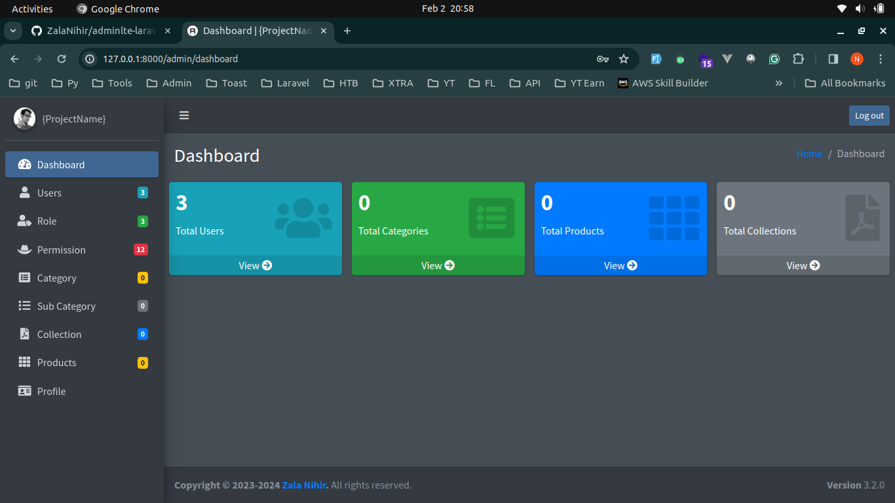
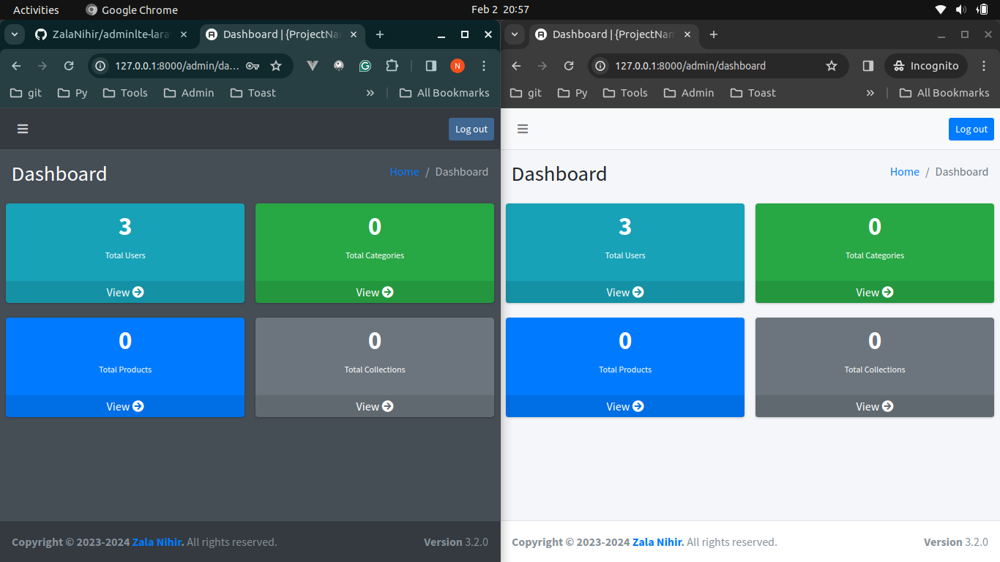

## AdminLTE in laravel-10
<p align="center"><a href="https://github.com/ZalaNihir/adminlte-laravel10" target="_blank"></a></p>

## Light-Dark Mode Using Bootstrap

<p align="center"><a href="https://github.com/ZalaNihir/adminlte-laravel10" target="_blank"></a></p>


## About This Projects

This project is made in Laravel version 10. In this project, I used an Admin LTE with a breeze installation. Users do have not to worry about assets & folder paths for the admin side. Created for basic e-commerce project admin.Added the basic modules. Don't forget to give star to this repository ⭐.

[](https://github.com/ZalaNihir/adminlte-laravel10)
[](https://github.com/ZalaNihir/adminlte-laravel10)
[](https://github.com/ZalaNihir/adminlte-laravel10)
[](https://opensource.org/licenses/MIT)


## Installation & usage
- For Install you have to clone this repo or you can fire this command as well.

```php
git clone https://github.com/ZalaNihir/adminlte-laravel10.git
```

- Go into folder

```php
cd adminlte-laravel10
```

- After the installation you have to update the vendor folder you can update the vendor folder using this command.

```php
composer update
```

- After the updation you have to create the ```.env``` file via this command.

```php
cp .env.example .env
```

- Now you have to generate the product key.

```php
php artisan key:generate
```

- Now migrate the tables & seed the database.

```php
php artisan migrate --seed
```

- We are done here. Now you have to just serve your project.

```php
php artisan serve
```

- This is the updated code of admin.

To get the access of admin side there is credentials bellow

- Admin

email: ```testadmin@gmail.com```
password: ```p$ssw#rd```

- User

email: ```testuser@gmail.com```
password: ```p$ssw#rd```

- Vendor

email: ```testvendor@gmail.com```
password: ```p$ssw#rd```


# Update

- Added the Light/Dark mode in profile section at top nav.

- Added the Category module.

- Added the Subcategory module.

- Added the product module which has basic detail & takes multiple images.

- Added the Role Module.

- Added the permission Module.

- Added the collection Module for PDFs.

- Added the Country, State & City seeder with the relationship

- if you want to use the admin side but you have no idea about components & how here things work. so that you just have to create a file & put your code.

- I added the functionality to compress the image size & convert it into webp format in the ```ProductController```.

# Toast

- Added the toastr which has 4 classes success, info, warning & error. you can use it own it.

```php
<x-admin>
    {{ 'Put your blade code here' }}
</x-admin>
```

- For the page title use a section method Like this.

```php
    @section('title')
        {{'Your Titlte'}}
    @endsection
```

# Alerts

- I added the alerts. You just have to call like this.

```php
->with('success', 'Success message');
->with('danger', 'danger message');
->with('info', 'info message');
->with('dark', 'dark message');
->with('warning', 'warning message');
->with('light', 'light message');
```

## Security Vulnerabilities

If you discover a security vulnerability within this project, please send an e-mail to Nihir Zala via [testnihir@gmail.com](mailto:testnihir@gmail.com). All security vulnerabilities will be promptly addressed.If you find any issue or bug you can mail me.

## License

The Laravel framework is open-sourced software licensed under the [MIT license](https://opensource.org/licenses/MIT).

## Friendly Note

- if you have any query about this package face some error or need support to update simply mail me<a href="mailto:testnihir@gmail.com"> here</a>.
- Sorry for my English & this type of short instruction. I'm learning if you are an expert please help me to improve.

# Connect with me
[](https://twitter.com/NihirZala)

[](https://www.linkedin.com/in/nihirzala/)

[](https://www.instagram.com/inihirzala/)

# Other Projects

Check My Other Project


<div width="100%" align="center"><a href="https://github.com/ZalaNihir/country-state-city-package/" align="left"></a>
